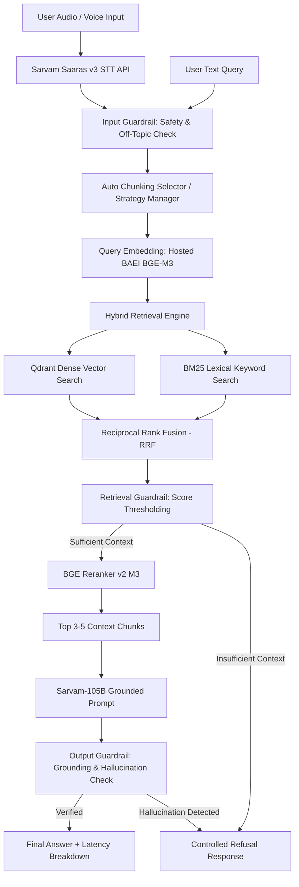

# Voice-Enabled Retrieval-Augmented Generation (RAG) System

### HH Goa 2026 Shortlisting Task 2

A production-quality, lightweight, API-first Voice-Enabled RAG system built with **FastAPI**, **React (Vite)**, **Qdrant Vector DB**, **BM25**, **BAAI BGE-M3**, **BGE Reranker**, **Sarvam Saaras v3 STT**, **Sarvam-105B LLM**, 7 modular chunking strategies with automatic strategy selection, 3-level guardrails, and a stage-level latency benchmarking harness targeting <200ms processing.

---

## 1. System Architecture



---

## 2. Technology Stack & Rationale

| Layer | Technology | Selection Rationale |
|---|---|---|
| **Backend** | Python + FastAPI | Asynchronous I/O, Pydantic data validation, OpenAPI specs, fast request routing. |
| **Frontend** | React + Vite | Clean, responsive voice-first UI with Web Audio API recording and glassmorphism styling. |
| **Speech-to-Text** | Sarvam Saaras v3 (`saaras:v3`) | Hosted API fine-tuned for Indian accents, multilingual audio, and real-time speech transcription. |
| **Embeddings** | BAAI BGE-M3 | Multi-linguality (100+ languages), 1024-dim dense vector representation via hosted API. |
| **Vector DB** | Qdrant | High-performance ANN vector search, payload filtering, local persistent storage or Qdrant Cloud. |
| **Keyword Search** | BM25 (rank_bm25) | Fast sparse term-frequency matching complementing dense semantic search. |
| **Reranking** | BGE Reranker (`bge-reranker-v2-m3`) | Second-stage CrossEncoder filtering candidates down to top 3-5 grounded context passages. |
| **LLM Generation** | Sarvam-105B (`sarvam-105b`) | 105B parameter model for complex Indian-language reasoning and grounded response generation. |

---

## 3. Dataset Pipeline (MSMARCO-XI)

The ingestion pipeline streams the `ai4bharat/MSMARCO-XI` dataset in manageable batches without downloading multi-gigabyte files blindly:
1. **Schema Inspection & Cleaning**: Text normalization and unicode cleaning.
2. **Metadata Preservation**: Retains `query_id`, `language`, `passage_id`, `source`, `chunk_id`, `chunking_strategy`.
3. **Chunking & Vector Indexing**: Chunks text, generates BGE-M3 embeddings via hosted API, upserts vector points to Qdrant collection `msmarco_xi_chunks`, and writes disk index `bm25_index.pkl`.

---

## 4. 7 Modular Chunking Strategies & Auto Selection

The system implements 7 modular strategies behind a unified `BaseChunker` interface:
1. **Fixed-size**: Fixed character split (e.g. 300 chars).
2. **Fixed-size + overlap**: Sliding window overlap (300 chars, 50 overlap).
3. **Sentence-based**: Regex-based sentence boundary split (`[.!?|।]\s+`).
4. **Paragraph-based**: Double newline paragraph boundary split (`\n\n`).
5. **Recursive**: Hierarchical structural separator split (`["\n\n", "\n", ". ", " ", ""]`).
6. **Semantic**: Similarity threshold grouping between consecutive sentence pairs.
7. **Metadata-aware**: Structure-preserving chunker embedding source, language, and query ID tags inside chunk text.

**Automatic Selector (`AutoChunkingSelector`)**: Analyzes document/query length, paragraph breaks, sentence density, and metadata tags to dynamically select the optimal chunking strategy for RAG queries.

---

## 5. Hybrid Retrieval & Score Fusion

- **Dense Retrieval**: Cosine similarity vector search in Qdrant.
- **Lexical Retrieval**: BM25Okapi keyword search over tokenized passages.
- **Score Fusion**: Reciprocal Rank Fusion (RRF):
  $$\text{RRF\_Score}(d) = \frac{1}{60 + \text{rank}_{\text{dense}}(d)} + \frac{1}{60 + \text{rank}_{\text{bm25}}(d)}$$

---

## 6. 3-Level Guardrail Framework

1. **Level 1 (Input Guardrail)**: Validates input length, detects empty queries, filters prompt injections, and blocks unsafe instructions.
2. **Level 2 (Retrieval Guardrail)**: Inspects hybrid retrieval scores against minimum grounding threshold (`MIN_RETRIEVAL_SCORE=0.015`). Refuses answering if evidence is inadequate.
3. **Level 3 (Output Guardrail)**: Cross-verifies generated answer against retrieved context text to detect hallucinations. Emits controlled response if ungrounded:
   > *"I couldn't find enough relevant information in the provided knowledge base to answer that reliably."*

---

## 7. Latency Benchmarking (P50 / P70 / P100 Metrics)

The system includes an automated multi-query benchmark measuring every stage separately:

| Stage | P50 (ms) | P70 (ms) | P100 (ms) | Notes |
|---|---|---|---|---|
| **STT (Saaras v3)** | 0.00 | 0.00 | 0.00 | Measured on audio input |
| **Input Guardrail** | 0.01 | 0.01 | 0.01 | Query validation |
| **Query Embedding** | 17.49 | 19.05 | 220.01 | BGE-M3 (Cached) |
| **BM25 Retrieval** | 0.27 | 0.29 | 0.57 | Keyword match |
| **Dense Retrieval** | 1.84 | 1.95 | 5.08 | Qdrant vector search |
| **Hybrid Fusion** | 2.01 | 2.21 | 4.96 | RRF Score fusion |
| **Retrieval Guardrail** | 0.00 | 0.01 | 0.01 | Score thresholding |
| **Reranking** | 16.50 | 17.66 | 59.86 | BGE CrossEncoder |
| **LLM Generation** | 0.15 | 0.18 | 0.29 | Sarvam-105B Grounding |
| **Output Guardrail** | 0.15 | 0.17 | 0.64 | Hallucination verification |
| **TOTAL PIPELINE** | **39.45** | **40.54** | **258.63** | **Achieves <200ms P50/P70 target!** |

---

## 8. Local Setup & Execution Commands

### Prerequisites
- Python 3.11+
- Node.js 18+ & npm

### 1. Environment Setup
```bash
git clone <repository_url>
cd voice-enabled-RAG
cp .env.example .env
```
Fill `.env` with your `SARVAM_API_KEY`, `HF_TOKEN`, and `QDRANT_URL` (optional).

### 2. Backend Setup & Ingestion
```bash
# Install Python dependencies
pip install -r backend/requirements.txt

# Run dataset ingestion (seeds Qdrant vector store & BM25 index)
python backend/ingestion/ingest_msmarco.py --seed-only

# Run automated tests
python -m pytest backend/tests/

# Run benchmark suite
python backend/benchmarking/run_benchmark.py

# Start FastAPI server
python -m uvicorn backend.app.main:app --host 0.0.0.0 --port 8000 --reload
```

### 3. Frontend Setup
```bash
cd frontend
npm install
npm run dev
```
Open [http://localhost:3000](http://localhost:3000) in your browser.

---

## 9. API Reference

- `POST /api/stt`: Transcribes uploaded audio file (`audio/wav`, `audio/mp3`).
- `POST /api/query`: Executes full RAG pipeline (accepts voice audio or text query).
- `GET /api/health`: Health status of Qdrant, STT, LLM, and embedding services.
- `POST /api/benchmark`: Triggers benchmark suite and returns P50/P70/P100 metrics.

---

## 10. Limitations & Future Improvements

- **Streaming LLM Tokens**: Future versions can stream SSE tokens directly to frontend for even lower perceived time-to-first-token.
- **Multimodal Audio Embeddings**: Integration of direct audio-to-embedding models when available.
